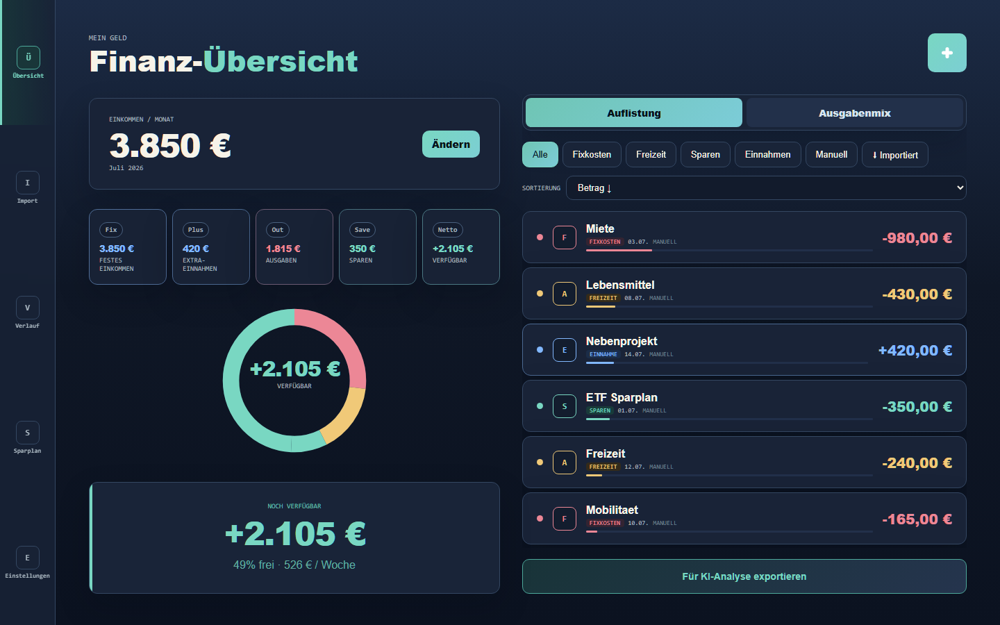
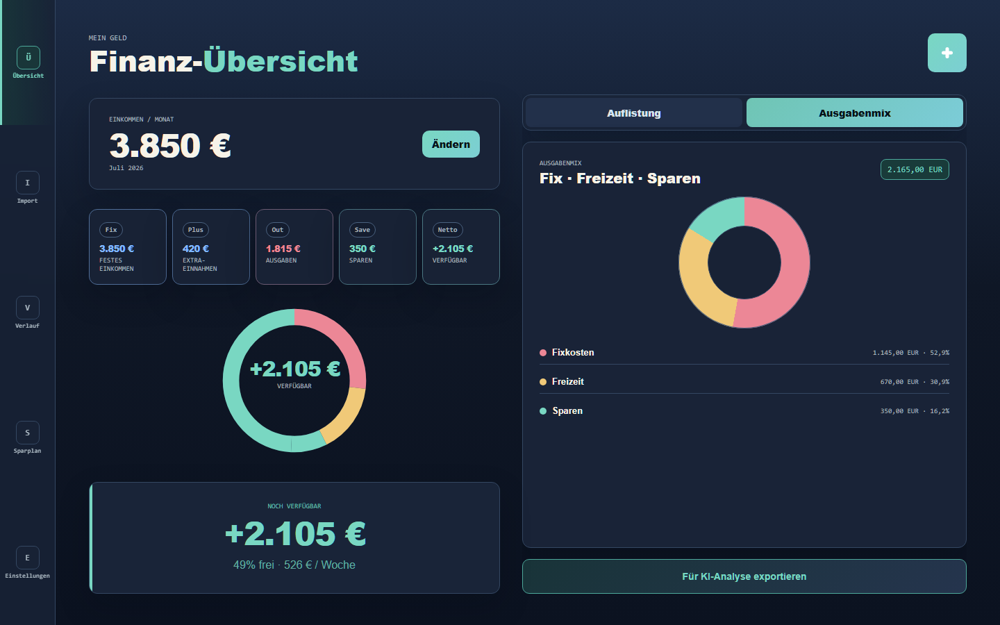
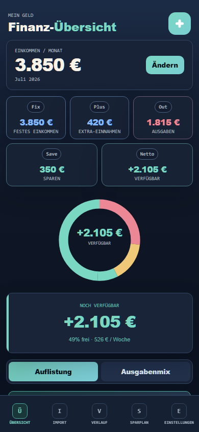
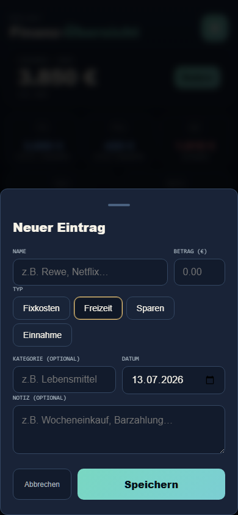

# FinanzApp

FinanzApp ist eine responsive Web-App zur monatlichen Verwaltung persönlicher Finanzen. Die App trennt feste Einnahmen, zusätzliche Einnahmen, Fixkosten, Freizeit-Ausgaben und Sparbeträge sauber voneinander und zeigt daraus eine verständliche Monatsübersicht.

Das Projekt ist als Portfolio- und Privatnutzungs-App gebaut: schlank, lokal nutzbar, mit Dark-Fintech-Design, Playwright-Tests und optionalem Feedback-Flow über GitHub Issues.

## Screenshots

### Desktop





### Mobile

<p align="center">
  
  
</p>

## Funktionen

- Monatsübersicht mit festem Einkommen, zusätzlichen Einnahmen, Ausgaben, Sparbeträgen und verfügbarem Betrag
- getrennte Erfassung von Fixkosten, Freizeit-Ausgaben, Sparbeträgen und Einnahmen
- Hinzufügen, Bearbeiten und Löschen von Transaktionen
- Ausgabenmix-Diagramm für Fixkosten, Freizeit und Sparen
- Sparziele mit monatlicher Rate und Fortschritt
- strukturierter KI-Export für manuelle Monatsanalysen
- JSON-Import für KI- oder Kontoauszugs-Auswertungen
- Dark- und Light-Theme
- responsive Oberfläche mit Desktop-Sidebar und mobiler Bottom Navigation
- Feedback- und Bug-Report-Formular mit Kopierfunktion
- optionale automatische GitHub-Issue-Erstellung über `/api/report-bug`

## Technischer Überblick

- Frontend: HTML, CSS und JavaScript
- Build-Tool und Dev-Server: Vite
- Tests: Playwright
- Persistenz: `localStorage`
- PWA-Basis: Manifest und Service Worker
- Optionale API: Vercel Serverless Function für Bug-Reports

## Projektfokus

FinanzApp ist bewusst keine Banking-App mit echter Kontoanbindung. Der Fokus liegt auf einer nachvollziehbaren lokalen Finanzübersicht:

- Daten bleiben im Browser.
- Es gibt keine Benutzerkonten.
- Es gibt keine Cloud-Synchronisation.
- Es wird keine externe KI-API automatisch aufgerufen.
- Der KI-Export wird manuell kopiert und bleibt damit transparent.

## Berechnungslogik

Die App trennt planbare Einnahmen und unregelmäßige Einnahmen:

```text
Verfügbar = feste Einnahmen + zusätzliche Einnahmen - Fixkosten - Freizeit - Sparen
```

Wichtig:

- `Einkommen / Monat` zeigt nur feste monatliche Einnahmen.
- Zusätzliche Einnahmen erhöhen den verfügbaren Betrag.
- Zusätzliche Einnahmen erscheinen nicht im Ausgabenmix.
- Der Ausgabenmix zeigt nur Fixkosten, Freizeit und Sparen.

## Installation

Voraussetzungen:

- Node.js
- npm

Abhängigkeiten installieren:

```bash
npm install
```

Lokale Entwicklung starten:

```bash
npm run dev
```

Danach die von Vite ausgegebene lokale URL im Browser öffnen.

## Build

```bash
npm run build
```

Build lokal prüfen:

```bash
npm run preview
```

## Tests

```bash
npm test
```

Weitere Testbefehle:

```bash
npm run test:headed
npm run test:ui
npm run test:report
```

Der letzte dokumentierte Teststatus steht in [TEST_REPORT.md](TEST_REPORT.md).

## Nutzung

1. Festes monatliches Einkommen eintragen.
2. Einnahmen, Fixkosten, Freizeit-Ausgaben oder Sparbeträge erfassen.
3. Monatswerte, Ausgabenmix und verfügbaren Betrag prüfen.
4. Optional den KI-Export kopieren und manuell analysieren lassen.
5. Bei Bedarf Feedback oder Bugs über das Feedback-Formular melden.

## Datenhaltung

FinanzApp speichert Daten lokal im Browser per `localStorage` unter dem Key `meingeld_v3`.

Das bedeutet:

- Daten bleiben auf dem jeweiligen Gerät und Browserprofil.
- Ein Browserwechsel übernimmt die Daten nicht automatisch.
- Gelöschte Browserdaten entfernen auch gespeicherte Finanzdaten.
- Für langfristige Nutzung wäre ein Export- und Backup-Konzept ein sinnvoller nächster Schritt.

## KI-Export

Der KI-Export erzeugt eine strukturierte Monatszusammenfassung. Einnahmen und Ausgaben werden bewusst getrennt, damit Analysen konsistent weiterverarbeitet werden können.

Enthaltene Bereiche:

- `einnahmen.fest`: festes monatliches Einkommen
- `einnahmen.zusatz`: zusätzliche Einnahmen aus Transaktionen mit Typ `income`
- `ausgaben.fixkosten`: Fixkosten
- `ausgaben.freizeit`: Freizeit-Ausgaben
- `ausgaben.sparen`: Sparbeträge
- `verfügbar`: feste Einnahmen + Extra-Einnahmen - Fixkosten - Freizeit - Sparen

## Bug Reports

In den Einstellungen steht ein Feedback-Formular zur Verfügung. Beim Absenden sendet die App die Formulardaten an `/api/report-bug`. Die Serverless Function erstellt daraus serverseitig ein GitHub Issue.

Der GitHub-Token wird nicht im Frontend verwendet. Er wird ausschließlich serverseitig über Environment Variables gelesen.

Benötigte Environment Variables:

```bash
GITHUB_TOKEN=github_pat_xxx
GITHUB_OWNER=Elvios97
GITHUB_REPO=FinanzApp
GITHUB_LABELS=bug,feedback
```

`GITHUB_TOKEN` benötigt Schreibrechte für Issues im Repository. `GITHUB_LABELS` ist optional und sollte nur Labels enthalten, die im Repository existieren.

Für lokale Tests mit Serverless Function:

```bash
npm run dev:vercel
```

Wenn die GitHub-Konfiguration fehlt oder ungültig ist, zeigt das Formular eine verständliche Fehlermeldung. Die Kopierfunktion bleibt als Fallback verfügbar.

## Projektstruktur

- `index.html`: Einstiegspunkt, Screens, Navigation und Modals
- `style.css`: Layout, Themes und responsive Darstellung
- `app.js`: zentrale UI- und Anwendungslogik
- `category-chart.js`: Diagrammlogik für den Ausgabenmix
- `db.js`: Datenmodell, Persistenz, Monatsberechnung und KI-Export
- `api/report-bug.js`: optionale Serverless Function für GitHub-Issues
- `tests/`: Playwright-End-to-End-Tests
- `docs/`: Projektdokumentation und Screenshots

## Qualitätssicherung

Vor Änderungen an Logik, Layout oder Persistenz sollten mindestens diese Checks laufen:

```bash
npm run build
npm test
```

Aktuell werden unter anderem geprüft:

- Desktop- und Mobile-Layout
- Einnahmen und Ausgaben hinzufügen
- Transaktionen bearbeiten und löschen
- Eingabevalidierung
- Summenberechnung
- Ausgabenmix-Diagramm
- Persistenz nach Reload
- Feedback-Flow mit API-Erfolg und Fehler-Fallback

## Roadmap

Was ich als Nächstes noch verbessern würde:

- einen einfachen Export und Re-Import einbauen, damit die lokalen Daten nicht nur im Browser hängen
- den Monatswechsel direkter machen, zum Beispiel mit Vor-/Zurück-Buttons statt nur über die Historie
- Budgets pro Kategorie ergänzen, damit man schneller sieht, wo man über dem eigenen Limit liegt
- die Live-Demo sauber veröffentlichen und gegen typische Edge Cases prüfen
- die Portfolio-Seite mit den aktuellen Screenshots und einer kurzen Projektbeschreibung aktualisieren
